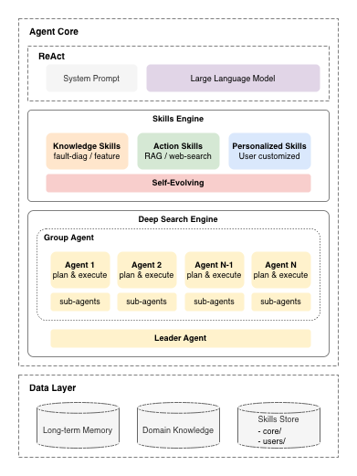

# 04. PoC 모듈 구현

> PdM Agent — 예지보전 AI 에이전트

## 기술 차별점 (Niche 영역)

**Agent Skills 기반 사용자 개인화 에이전트**

- `skills/core/`(조직 공통)와 `skills/users/`(사용자별 맞춤) 분리로 동일 에이전트가 사용자에 따라 다른 도메인 지식을 로드
- Edge 산출 결과(`anomaly_detected`, `health_state`)를 State에 반영하여 필요한 Skill만 조건부 로드 (Progressive Disclosure)
- 정상 이벤트에서는 결함 진단 Skill 미로드 → 토큰 약 60% 절감

**아키텍처 다이어그램:**



## 핵심 구현 내용

### 에이전트 워크플로우

LangGraph 7노드 StateGraph로 E2E 워크플로우 구현:

| **노드** | **역할** |
| --- | --- |
| `load_memory` | PostgreSQL에서 동일 설비/베어링 최근 5건 분석 이력 조회 → 자연어 요약으로 컨텍스트 주입 |
| `reasoning` | 시스템 프롬프트 + 페이로드 + Memory + Knowledge Skills + Action Skills(bind_tools)로 ReAct 추론. 이상 이벤트에서 Tool 미호출 시 자동 유도(nudging), 진단 JSON 미포함 시 재요청 |
| `tool_executor` | LLM이 호출한 Action Skill 실행 후 reasoning으로 복귀 (추론 루프). tool_calls_count 누적 |
| `parse_diagnosis` | LLM 응답에서 진단 JSON 추출 (코드블록 → raw JSON → fallback 기본값). fault_type 필수 검증 |
| `generate_report` | Normal/Watch: 간결 요약. Warning/Critical: LLM 기반 상세 리포트 (결함 요약, 근거, RUL, 권고, 불확실성) |
| `generate_work_order` | Warning/Critical에서만 실행. 자재/공구 레퍼런스 라이브러리 프롬프트로 구조화 JSON 생성. 결정적 필드(wo_number, 설비, 일자)는 코드에서 오버라이드 |
| `save_memory` | 진단 결과를 PostgreSQL 영구 저장 (정상 포함). Tool 사용 이력, Deep Research 플래그 기록 |

**조건부 분기:**

```
START → load_memory → reasoning → (조건부 분기)
                                    ├─ call_tool → tool_executor → reasoning (루프)
                                    ├─ continue_reasoning → reasoning
                                    └─ generate_report → parse_diagnosis → generate_report
                                          ├─ Warning/Critical → generate_work_order → save_memory → END
                                          └─ Normal/Watch → save_memory → END
```

안전장치: `tool_calls_count > max_tool_calls` (기본 10, 환경변수 `PDM_AGENT_MAX_TOOL_CALLS`로 설정) 시 강제 `parse_diagnosis` 전이로 무한 루프 방지

### 도구(Tool) 및 함수 연동

Agent Skills를 Knowledge Skills(도메인 지식)과 Action Skills(실행형 도구)로 이원 구조화:

**Action Skills** (LangChain `@tool`, 서버 직접 호출):

| **Tool** | **기능** |
| --- | --- |
| `search_maintenance_history` | 고장/정비 이력 의미적 검색 (equipment_id, bearing_id 필터) |
| `search_equipment_manual` | 매뉴얼, FMEA, 정비 절차서 검색 (doc_type 필터) |
| `search_analysis_history` | 에이전트 과거 분석 판단 이력 검색 |
| `notify_maintenance_staff` | 정비 담당자 알림 (Watch 이상). PoC에서는 로깅, 프로덕션에서 이메일/Slack 확장 가능 |
| `search_web` | Tavily API 기반 외부 웹 검색. Deep Research에서만 사용하며, 내부 RAG 보완용 |

- RAG 검색 3종은 RAGServer를 in-process 직접 호출하여 프로토콜 오버헤드 제거
- 모든 서버 인스턴스는 지연 초기화(싱글턴)로 관리
- Tool 결과는 JSON 문자열로 반환

**Knowledge Skills** (md, 조건부 프롬프트 주입):

| **Skill** | **로드 조건** | **내용** |
| --- | --- | --- |
| `fault-diagnosis` | anomaly_detected = true | 결함 주파수 해석, P-F 곡선 4단계 |
| `feature-interpret` | anomaly_detected = true | Kurtosis+RMS 복합 패턴, Crest Factor 전이 |
| `deep-research` | deep_research_activated = true | 가설→RAG→외부검색→해석 루프 |
| `response-normal` | health_state != warning/critical | Normal/Watch 응답 양식 |
| `response-alert` | health_state = warning/critical | Warning/Critical 응답 양식 |

- 레지스트리(`SkillEntry`)에 조건 함수(`condition`)와 우선순위(`priority`)를 등록하여 State 기반 조건부 로딩
- priority 오름차순으로 정렬하여 프롬프트에 주입 (`fault-diagnosis` → `feature-interpret` → `response-*` 순)

**User Skills** (md, 사용자별 커스텀 Skill):

- `skills/users/{user_id}/` 디렉토리에 YAML frontmatter 기반 Skill 파일 배치
- 컨텍스트별 매칭: `always`, `chat`, `agent`, `anomaly_detected`, `alert`
- CRUD API 제공: `save_user_skill()`, `delete_user_skill()`, `list_user_skills()`
- 에이전트와 대화형 채팅 모두에서 사용자별 Skill 자동 로드

### API 레이어

FastAPI 기반 REST API + SSE 실시간 스트리밍:

| **엔드포인트** | **메서드** | **기능** |
| --- | --- | --- |
| `/api/events` | POST | Edge 이벤트 페이로드 수신 → 에이전트 백그라운드 실행 → run_id 반환 |
| `/api/agent/stream/{run_id}` | GET (SSE) | 에이전트 실행 이벤트 실시간 스트리밍 (노드 진입, 추론 토큰, Tool 호출, 진단 결과, 리포트, 작업지시서) |
| `/api/chat` | POST | 정비 담당자 대화형 질의 수신 → session_id 반환 |
| `/api/chat/stream/{session_id}` | GET (SSE) | 대화형 응답 실시간 스트리밍 |

- `RunManager`에서 run_id/session_id별 `asyncio.Queue`로 이벤트 관리
- SSE 이벤트 타입: `RunStartedEvent`, `NodeEnteredEvent`, `ReasoningTokenEvent`, `ToolCallEvent`, `ToolResultEvent`, `DiagnosisEvent`, `ReportGeneratedEvent`, `WorkOrderGeneratedEvent`, `RunCompletedEvent`, `ErrorEvent`
- `AgentRunner` 프로토콜로 `LangGraphAgentRunner`(실제) / `MockAgentRunner`(데모) 교체 가능
- 대화형 채팅은 `LLMChatRunner`가 에이전트 그래프와 독립적으로 LLM 직접 호출

### 데이터 및 메모리

| **저장소** | **구성** | **용도** |
| --- | --- | --- |
| Qdrant `maintenance_history` | 80건 (완료보고서 40 + 작업지시서 40), Document-level 청킹 | 유사 결함 사례 검색 |
| Qdrant `equipment_manual` | 7건, Recursive 청킹 (H2/H3 기반) | 결함 메커니즘, 정비 절차 참조 |
| Qdrant `analysis_history` | 동적 증가, Record-level 청킹 | 과거 판단 의미적 검색 |
| PostgreSQL `pdm_agent_memory` | 모든 판단 결과 영구 저장 | 시계열 변화 추적, 최근 5건 컨텍스트 주입 |

- Embedding: OpenAI `text-embedding-3-small` (1536차원, Dense)
- PostgreSQL 스키마: equipment_id, bearing_id, event_id, fault_type, fault_stage, degradation_speed, risk_level, ml_rul_hours, recommendation, tools_used(JSONB), deep_research, human_response, action_taken, resolved 등
- `MemoryStore.load_recent()`: 설비/베어링 기준 최근 5건 조회 → `summarize_history()`로 자연어 요약

## 주요 문제 해결 및 기술 리서치

| **이슈** | **문제** | **해결** |
| --- | --- | --- |
| **프롬프트 토큰** | 시스템 프롬프트에 전체 도메인 지식 포함 → 정상 이벤트에서도 15K 토큰 소비 | Knowledge Skills로 분리 + State 기반 조건부 로딩. 정상 이벤트 토큰 60% 절감 (15K→6K) |
| **JSON 출력** | LLM이 진단 JSON을 누락하거나 비표준 형식으로 출력 | `parse_diagnosis`에 다중 파싱 (코드블록→raw JSON→fallback). reasoning에서 JSON 미포함 시 재요청 메시지 자동 주입 |
| **Tool 호출 유도** | 이상 이벤트에서 LLM이 Tool 호출 없이 분석을 종료하는 경우 발생 | reasoning 노드에서 `anomaly_detected=true`이고 `tool_calls_count=0`일 때 search_maintenance_history 호출을 유도하는 nudge 메시지 자동 주입 |
| **Tool 연동** | MCP stdio transport의 서브프로세스 오버헤드 (Tool 호출당 2~3초) | Action Skills로 전환 — RAGServer를 in-process 직접 호출하여 프로토콜 오버헤드 제거 |
| **작업지시서 일관성** | LLM이 wo_number, 설비명, 일자 등을 부정확하게 생성 | 결정적 필드(wo_number, equipment, location, request_date, work_type)를 코드에서 오버라이드. 자재/공구 레퍼런스 라이브러리를 프롬프트에 포함하여 표준 코드 사용 유도 |
| **SSE 노드 구분** | `astream_events`에서 모든 노드의 LLM 출력이 섞임 | `current_node` 변수로 노드 추적, reasoning에서만 토큰 스트리밍 emit |
| **비동기 큐** | FastAPI→Streamlit SSE 스트리밍의 큐 관리 및 연결 종료 처리 | `RunManager`에서 run_id별 `asyncio.Queue` 관리 + `asyncio.timeout(300)` 안전장치 |

## 핵심 동작 검증

**검증 시나리오: SC-003 (결함 진행 구간 — Warning)**

**입력:** IMS Dataset #1, Bearing 3 내륜 결함 — 25일차

- `anomaly_detected: true`, `health_state: "warning"`, `anomaly_score: 0.78`
- 주파수: BPFI 우세, 2차 고조파, 사이드밴드 관찰
- 시간: Kurtosis 5.2, RMS 0.15g, Crest Factor 4.8
- 추세: 15일 대비 RMS 50% 증가, 가속 미감지

**에이전트 동작:**

1. `load_memory` — 이전 이력 2건 조회 (5일차 정상, 15일차 Watch)
2. `reasoning` —
    - Thought 1: anomaly_detected → fault-diagnosis Skill 로드 → BPFI + 고조파 → 내륜 결함 식별
    - Thought 2: feature-interpret Skill 로드 → Kurtosis+RMS+고조파 → P-F 3단계 판정
    - Thought 3: RMS 증가율 해석, 가속 미감지 → 선형 열화
    - Thought 4: ML RUL 120시간과 에이전트 판정 일치
    - Thought 5: Warning 판정 → response-alert Skill 로드
3. `tool_executor` — `search_maintenance_history` 1회 (유사 사례 참조)
4. `parse_diagnosis` → `generate_report` → `generate_work_order` → `save_memory`

**최종 결과:**

- **진단:** 내륜 결함, P-F 3단계, 선형 열화, RUL ~120h
- **리포트:** 결함 근거 + 이전 이력 변화 추이 + 유사 사례 + 정비 권고
- **작업지시서:** 예방정비, 베어링 교체 절차, 필요 자재/공구(레퍼런스 라이브러리 기반), 시운전 점검 항목
